# ReVisPort
ReVisPort is a Python command line reporting tool which enable users to create simple reports. The reports provide the user with descriptive summary of climate data [climate data](https://github.com/owid/co2-data/blob/master/owid-co2-codebook.csv) of EU countries, presented by [Our World in Data](https://ourworldindata.org/co2-and-greenhouse-gas-emissions) . Besides that, ReVisPort offers the users to add the created reports to their personalized favourites list. Notes or findings can be added to simplify the task of finding interesting data insights. In addition, the user have a possibility to contact the developers of ReVisPort. [View](https://re-vis-port-06a4efd9c1c6.herokuapp.com/) the app on-line.

 
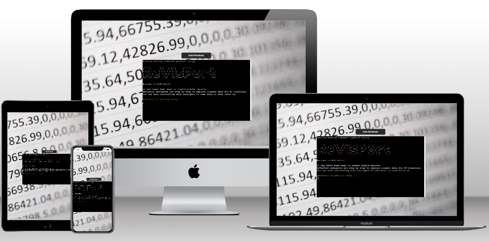

---

## Table of Contents
- [UX](#ux)
- [Features](#features)
- [Testing](#testing)
- [Deployment](#deployment)
- [Technologies](#technologies)
- [Credits & Inspirations](#credits&inspirations)
- [Acknowledgements](#acknowledgemetns)

---
## UX
The goal of ReVisPort is to search for interesting insights of climate data. ReVisPort targets particully users interesting in climate data and data generally. Users do not have to any pre-knowledge about reporting, ReVisPort navigates users step by step. However, bacis knowledge about descriptive statistics are required in order to interprete results.

### User Stories
- As a User, I would like create a report without any programming nor statistic knowledge.
- As a User, I would like to be able to change choices I made.
- As a User, I would like to display a created report with all standard aspects.
- As a User, I would like to make notes to about the data instights
- As a User, I would like to have a possibility to save a report.
- As a User, I would like to see all my saved reports and come back to each of them.
- As a User, I would like to delete a saved report, which I do not need anymore.
- As a User, I would like to return to home menu without restarting the application.
- As a User, I would like to write reference or contact the application developer.

### Structure & Logical Flow
- **App structure** was designed using flow chart created in [Lucid](https://lucid.app/documents#/documents?folder_id=recent). The app was desined using a menu-system. All flow charts are displayed bellow:
    - Home Menu 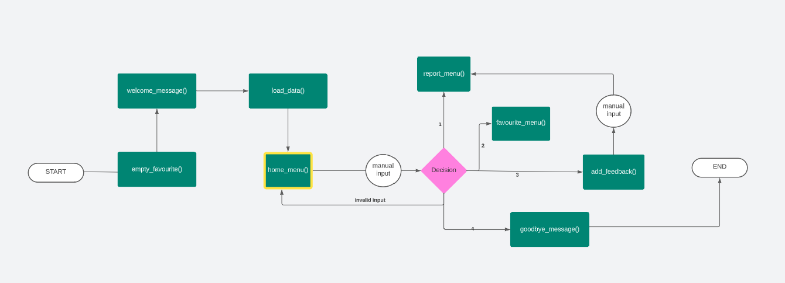
    - Reporting Menu 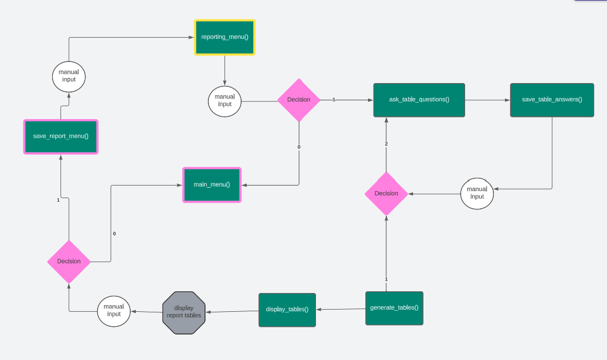
    - Save Report Menu 
    - Favourites Menu 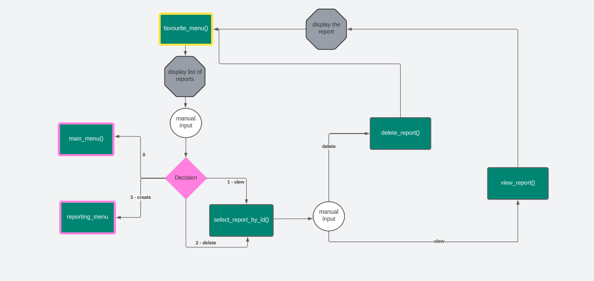
    - Contact Menu 

 

- **Data Structure**
    - The app data are in form of structed data, i.e. table with columns and rows.
    - The data are stored in Google Sheet.

### Colors
Colored text using ANSI code was considered to make the command line application more user-friendly. In total, five colors were selected. Each color was used only for one purpose, see Table below.

| Color  | ANSI Code | Purpose                                         | Examples                                |
|--------|-----------|-------------------------------------------------|-----------------------------------------|
| White  | [95m      | displayed information or user inputs |                                         |
| Green  | [92m      | actions, successes     | Saving report ...            |
| Purple | [95m      | asking for user inputs                     |    Enter your choice: |
| Yellow | [33m      | warnings                                        | Invalid data                            |
| Cyan   | [96m      | questions or menus                              | Select a time period from 2000 and 2020 |

In the orginal CI template, the red color of button was selected. This was changed to the black color to better fit with the background image.

---
## Features
The app uses a menu-system to ask user for inputs data. The user choices are always validated for the correctness. In case of an incorrect input or input format, a warning message is displayed. The warning mostly tells user a reason for an invalid input and ask to try again.

### Existing Features
*Overview of existing features*

- [Starting App](#starting-app)
- [Home Menu](#home-menu)
    - [Report Input Parameters](#report-input-parameters-to-generate-data-tables)
    - [Saving Report](#saving-report)
-[Favourites Menu](#favourites-menu)
    - [View a report](#view-a-report)
    - [Delete a report](#d)

 
 

*Detailed description of existing features:*

- #### Starting App
    - After opening the app, the app title and short introductury text is displayed.
    - User is also informed that the app is getting ready. This means that all data are loaded to reduced user waiting time later on.
    - Implementation: 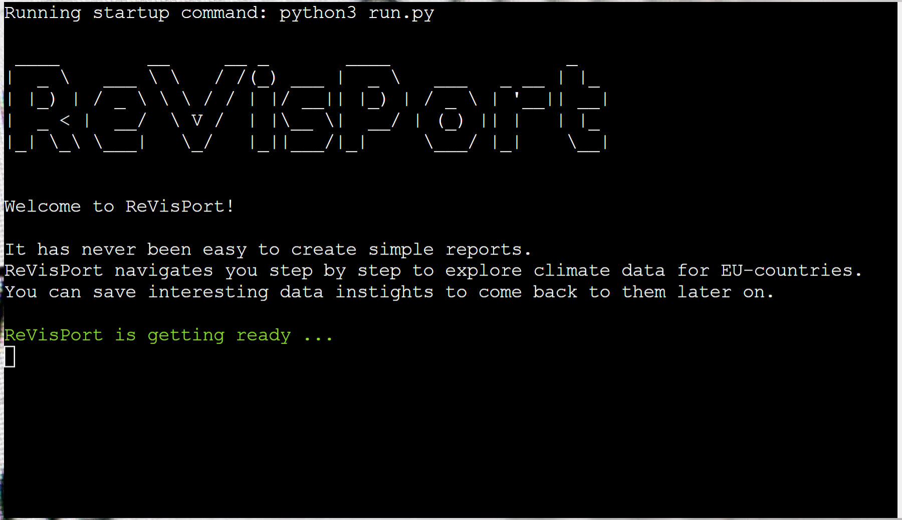

 

- #### Home Menu
    - After loading the data, Home Menu is displayed, with the following options:
        - 1. Reporting - User can create a report.
        - 2. Favourite - User can view or delete a report.
        - 3. Contact - User can contact developer to send, for example a feedback.
        - 0. Quit - User can quit the app.
    - Implementation: 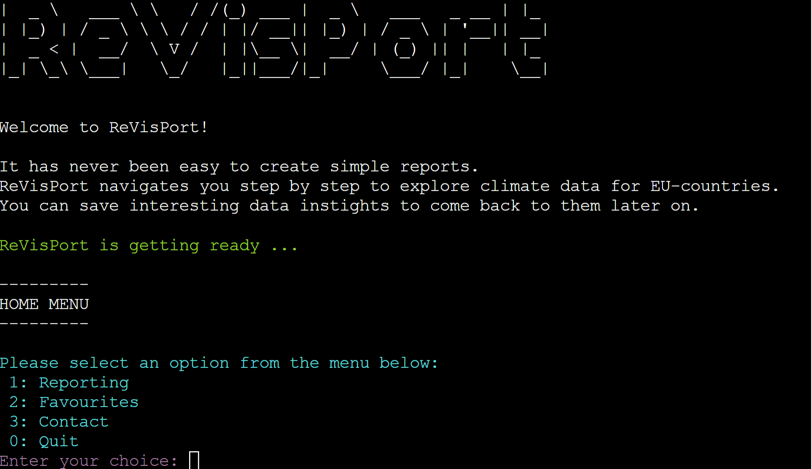

 

- #### Reporting (Report Menu)
    - A user is informed about the contect and actions in REPORTING submenu. There is still a possibility to go back to HOME menu.
    - Implementation: 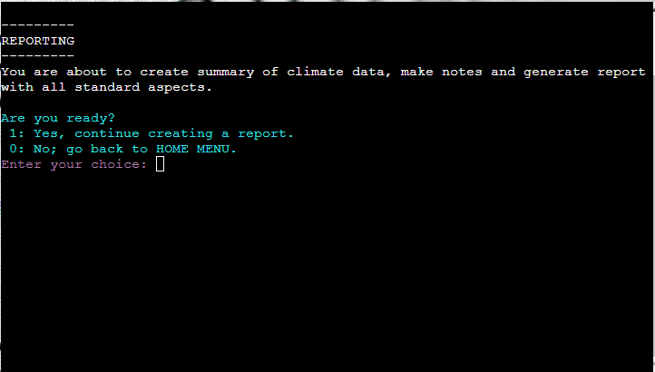

    - #### Report Input Parameters
        - In the following, a user is ask to enter the inputs to generate first report table and then additional report aspects.
        - **Report table inputs**
            - In order to create the report table, a user has to make choices on.
                1. EU countries in the form of ISO codes (more countries are allowed)
                2. Time period (time range)
                3. Climate data index (only one index is allowed)
            - Implementation: 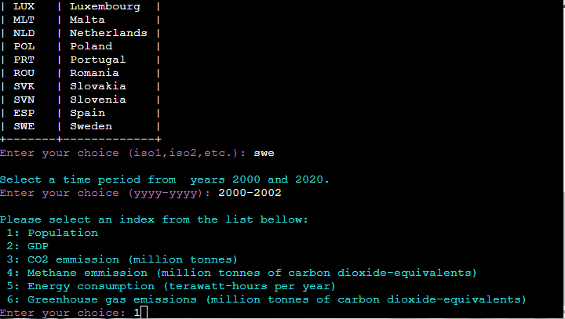
        - **Report table inputs confirmation**
            - A user is ask to confirm the choices in order to proceed further with table creation. There is a possibility to change the input selection.
            - Implementation: 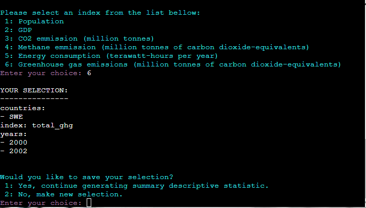
        - **Report tables**
            - Two tables are displayed. First, the raw data are shown based. In case of missing data, a user is informed with a warning message. Second, a summary table containing basic descriptive statistics. 
            - Finally, a user should decided if the tables should be saved.A user has also possibility to return to the HOME menu.
            - Implementation: 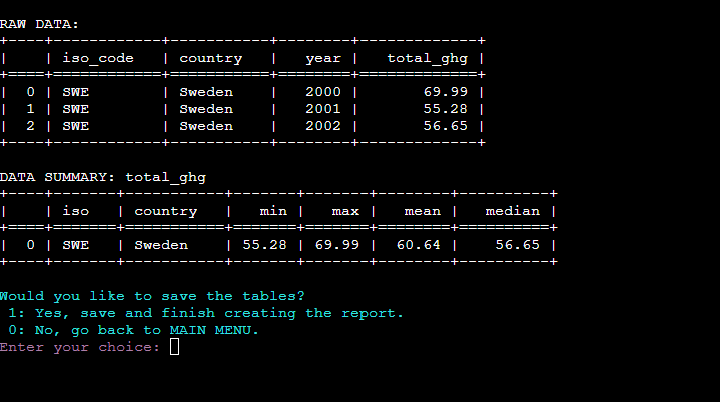
    - #### Saving Report
        - Once the user confirm to finish the report, the tables are saved and the following information needs to be filled in:
            - Report title (required and unique)
            - Report author
            - Report notes & findings
        - Implementation: 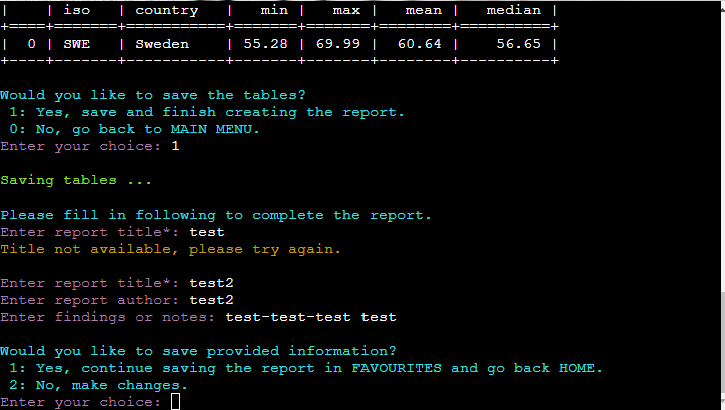
        - The user is ask to confirm the given information and save the report into FAVOURITES.
            - If the user deciced to agree, the report is saved and the user is informed about all actions. 
            - Finally, the user is navigated to the HOME menu, where the user can view the saved report.
            - Implementation: 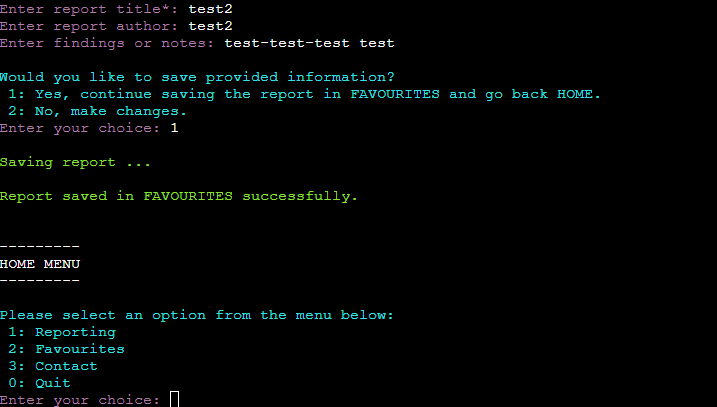
        - Note: The report information is saved to Google sheet. The report tables are saved as CSV file in the report folder.

 

- #### Favourites Menu
    - The Favourites submenu displays first all saved report and then the actully menu is shown.
    - The overview of the saved reports displays title, author and notes of the report. Only 17 characters of each are displayed.
    - User can select from the following, including the option returning to the HOME menu.
        - 1. View a report
        - 2. Delete a report
        - 3. Create a report - user is navigated to the REPORTING submenu
        - 0. HOME menu - user is navigated back to HOME
    - Implementation: 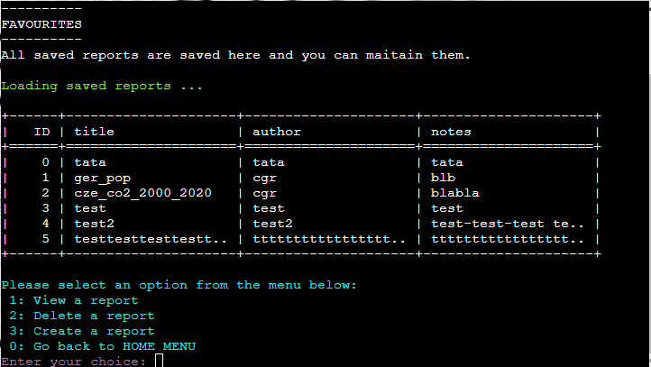

    - #### View a report
        - After selecting the option "View a report", the user is first ask to select the report ID.
        - Implementation: 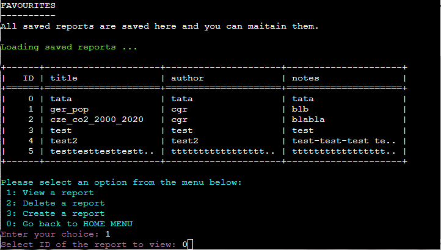

        - **Displayed report**
            - Onec the report ID is entered, the corresponding report is displayed.
            - The report contains following aspects: title, author, notes, summary data table, and raw data table.
            - Implementation: 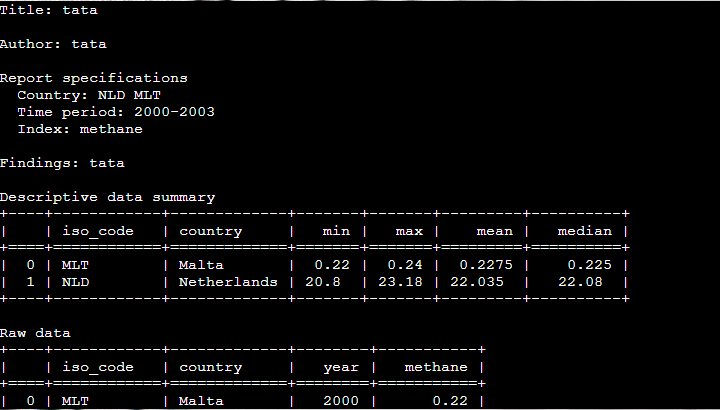
            - Any key can be pressed to close report and come back to FAVOURITES, see [implementation](./docs/features/view_report_close_report.png)

    - #### Delete a report
        - After selecting the option "Delete a report", the user is ask to select the report ID.
        - Implementation: 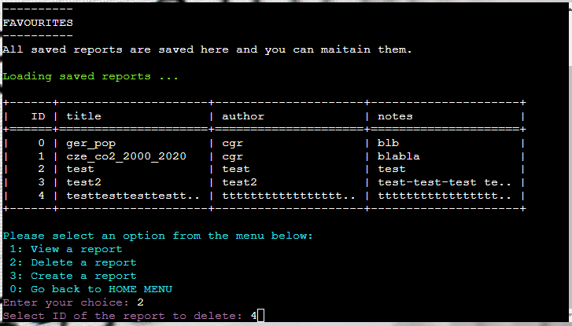
        - A user is informed about deleting the report and directed back to FAVOURITES with the list of available reports, see [implementation](./docs/features/delete_report_deleted.png)
        - Note: Report is removed from Google Sheet. The report tables are removed from the report folder.

- #### Contact Menu
    - A user is infomred about the possible procedures in the CONTACT Menu. The user can either send a message or go back HOME.
    - Implementation: 

    - #### Contact Form
        - Once the user agree with sending the message, a contact from must be filled in.
        - The following information are ask to enter:
            - First name
            - Last name
            - Email - a required input
            - Message - a required input
        - The user has the option to change the entered information. 
        - Implementation: 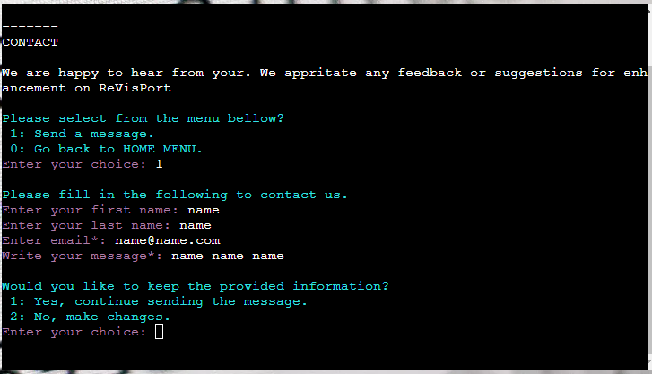
        - The user is informed about sending message and ask to press any key to return HOME, see [implementation](./docs/features/contact_sent.png)

    

        

### Future Enhancements

## Testing

## Deployment

### To Fork
TODO

### To Clone Repository
In order to clone the repository locally, follow the steps:

1. On Git
    - Go to the repository, i.e. https://github.com/brodsa/re-vis-port
    - You see the content of the repository, i.e. all the files are listed. On the right side at the top of the list, find the Code drop down button and click on it.
    - Copy the repository HTTPS link to the clipboard.
2. In the terminal (Note: git must be preinstalled) 
    - Open the terminal and navigate, where you want to clone the repository.
    - Type `git clone` and insert the content from the clipboard, leading to the command `git clone https://github.com/brodsa/re-vis-port.git`. 
    - Once the project is cloned, you can start using the repository locally.

### To Deploy on Heroku

In order to deploy the app on Heroku, an account is required. The steps for the deyploment are as follows:
1. Click "New" and "Create new App" from the menu at right top, see [screenshot](./docs/deployment/01_click_new.png).
2. Insert a app name and select a region. Click "Create App"; see [screenshot](./docs/deployment/02_create_app.png).
3. Select the "GitHub" deployment method; see [screenshot](./docs/deployment/03_deployment_method.png)
4. Search for a repository to connect and a branch to deploy; see [screenshot](./docs/deployment/04_select_repository_branch.png)
5. In the "Setting" tab, go in the section "Buildpacks" and add two buildpacks in the following order (see [here](./docs/deployment/06_buildpacks.png)): 
    - `heroku/python`
    - `heroku/nodejs`
6. In the "Config Var" section, add two variables (see [screenshot](./docs/deployment/07_config_vars.png)):
    - `PORT`: 8000
    - `CREDS`: credentials to connect with a google worksheet
7. In the "Domain" section, copy the URL to view the app; see [screenshot](./docs/deployment/08_copy_url.png).

## Technologies
### Languages
- Python
    - [art](https://pypi.org/project/art/)
    - [gspread](https://docs.gspread.org/en/v5.10.0/)
    - [google_auth](https://google-auth.readthedocs.io/en/master/)
    - [pandas](https://pandas.pydata.org/)
    - [tabulate](https://pypi.org/project/tabulate/)
    - [PyYAML](https://pypi.org/project/PyYAML/)
- Markdown

### Tools
- [Lucid](https://lucid.app/documents#/documents?folder_id=recent) to create a flow chart.
- [Generator of Markdown Tables](https://www.tablesgenerator.com/markdown_tables)
- [PEP Validators](https://pep8ci.herokuapp.com/#)
- [Image Compressor](https://tinypng.com/) was used to compress the images.
- [Image Converter](https://ezgif.com/) was used to convert all images in the webp format.
- [Mockup Generator](https://techsini.com/multi-mockup/index.php)

## Credits & Inspiration
- Data Sources
    - [Our Word in Data](https://github.com/owid/co2-data/blob/master/owid-co2-codebook.csv)
    - [List of the EU countries](https://european-union.europa.eu/principles-countries-history/country-profiles_en)
- Documentation of all listed python libraries, see (#languages)
- [Empty directory](https://stackoverflow.com/questions/185936/how-to-delete-the-contents-of-a-folder)
- [Color definition](https://www.geeksforgeeks.org/print-colors-python-terminal/)
- [ANSI color coding](https://codehs.com/tutorial/andy/ansi-colors)
- Background Image by [Mika Baumeister](https://unsplash.com/photos/Wpnoqo2plFA?utm_source=unsplash&utm_medium=referral&utm_content=creditShareLink) on [Unsplash](https://unsplash.com/photos/Wpnoqo2plFA?utm_source=unsplash&utm_medium=referral&utm_content=creditCopyText)
- [Repository Template from Code Institute](https://github.com/Code-Institute-Org/p3-template)

## Acknowledgements
I would like to thank my mentors, [Gareth McGirr](https://github.com/Gareth-McGirr) and [TODO](), for their guidance through my project and their valuable inputs. And my special thanks go to my husband for being supportive during the development of the program.

