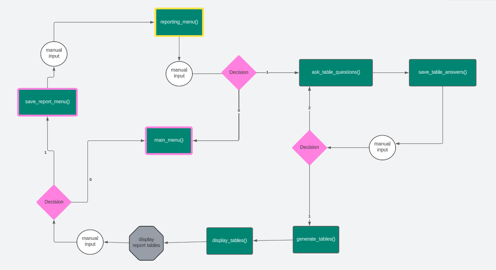

# ReVisPort
ReVisPort is a Python command line reporting tool that enables users to create simple reports. The reports provide the user with a descriptive summary of [climate data](https://github.com/owid/co2-data/blob/master/owid-co2-codebook.csv) for EU countries, presented by [Our World in Data](https://ourworldindata.org/co2-and-greenhouse-gas-emissions). Besides that, ReVisPort offers users the option to add the created reports to their personalised favourites list. Notes or findings can be added to simplify the task of finding interesting data insights. In addition, the user has the possibility of contacting the developers of ReVisPort. [View](https://re-vis-port-06a4efd9c1c6.herokuapp.com/) the app online.
 

---

## Table of Contents
- [UX](#ux)
- [Features](#features)
- [Testing & Validation](#testing--validation)
- [Deployment](#deployment)
- [Technologies](#technologies)
- [Credits & Inspirations](#credits&inspirations)
- [Acknowledgements](#acknowledgemetns)

---
## UX
The goal of ReVisPort is to search for interesting insights in climate data. ReVisPort targets particularly interested users in climate data and data generally. Users do not have to have any prior knowledge about reporting; ReVisPort navigates users step by step. However, basic knowledge of descriptive statistics is required in order to interpret results.

### User Stories
- U1: As a User, I would like to create a report without any programming knowledge.
- U2: As a User, I would like to be able to change the choices I make.
- U3: As a User, I would like to display a created report with all standard aspects.
- U4: As a User, I would like to make notes about the data insights.
- U5: As a User, I would like to have the possibility of saving a report.
- U6: As a User, I would like to see all my saved reports and come back to each of them.
- U7: As a User, I would like to delete a saved report, which I do not need anymore.
- U8: As a User, I would like to return to the home menu without restarting the application.
- U9: As a User, I would like to write a reference or contact the application developer.

### Structure & Logical Flow
- **App structure** was designed using a flow chart created in [Lucid](https://lucid.app/documents#/documents?folder_id=recent). The app was designed using a menu system. All flow charts are displayed below:
    - Home Menu 
    - Reporting Menu 
    - Save Report Menu 
    - Favourites Menu 
    - Contact Menu 

 

- **Data Structure**
    - The app data is structured data, i.e., a table with columns and rows.
    - The data is stored in Google Sheet.

 

- **Code Structure**
    - Python code is structured into modules, which are organised in the revisport package.
    - Following modules were created:
        - `colours.py` - Contains constants for ANSI colour definitions.
        - `contact.py` - Contains functions and a class definition related to the CONTACT submenu.
        - `favourites.py`- Contains functions related to FAVOURITES submenu.
        - `helpers.py` - Contains supportive functions.
        - `home.py` - Contains functions related to the HOME menu.
        - `quit.py` - Contains functions related to the QUIT submenu.
        - `reporting.py` - Contains functions and a class definition related to the REPORTING submenu.

### Colours
Coloured text using ANSI code was considered to make the command-line application more user-friendly. In total, five colours were selected. Each colour was used only for one purpose; see the table below.

| Color  | ANSI Code | Purpose                                         | Examples                                |
|--------|-----------|-------------------------------------------------|-----------------------------------------|
| White  | [95m      | displayed information or user inputs |                                         |
| Green  | [92m      | actions, successes     | Saving report ...            |
| Purple | [95m      | asking for user inputs                     |    Enter your choice: |
| Yellow | [33m      | warnings                                        | Invalid data                            |
| Cyan   | [96m      | questions or menus                              | Select a time period from 2000 and 2020 |

In the original CI template, the red colour of the button was selected. This was changed to black to better fit with the background image.

---
## Features
The app uses a menu system to ask the user for input data in order to create a report. The user's choices are always validated for correctness. In the case of incorrect input or input format, a warning message is displayed. The warning mostly tells the user the reason for an invalid input and asks them to try again.

### Existing Features
*Overview of existing features*

- [Starting App](#starting-app)
- [Home Menu](#home-menu)
- [Reporting Menu](#reporting-report-menu)
    - [Report Input Parameters](#report-input-parameters-to-generate-data-tables)
    - [Saving Report](#saving-report)
- [Favourites Menu](#favourites-menu)
    - [View a report](#view-a-report)
    - [Delete a report](#delete-a-report)
- [Contact Menu](#contact-menu)

 

*Detailed description of existing features:*

- #### Starting App
    - After opening the app, the app title and a short introductory text are displayed.
    - User is also informed that the app is getting ready. This means that all data is loaded to reduce user waiting time later on.
    - Implementation:   
    

 

- #### Home Menu
    - After loading the data, the Home Menu is displayed with the following options:
        - 1. Reporting - User can create a report.
        - 2. Favourites - User can view or delete a report.
        - 3. Contact - User can contact the developer to send, for example, feedback.
        - 0. Quit - User can quit the app.
    - Implementation:       
    

 

- #### Reporting (Report Menu)
    - User is informed about the content and actions in the REPORTING submenu. There is still the possibility of going back to the HOME menu..
    - Implementation:      
    

    - #### Report Input Parameters
        - In the following, a user is asked to enter the inputs to generate the first report table and then additional report aspects.
        - **Report table inputs**
            - In order to create the report table, a user has to make choices.
                1. EU countries in the form of ISO codes (more countries are allowed)
                2. Time period (time range)
                3. Climate data index (only one index is allowed)
            - Implementation:     
            
        - **Report table inputs confirmation**
            - A user is asked to confirm the choices in order to proceed further with table creation.  There is also the possibility of changing the input selection.
            - Implementation:    
            
        - **Report tables**
            - Two tables are displayed. First, the raw data are shown. In the case of missing data, a user is informed with a warning message. Second, a summary table containing basic descriptive statistics. 
            - Finally, the user should decide if the tables should be saved. The option to return to the HOME menu is also available.
            - Implementation:     
            
    - #### Saving Report
        - Once the user confirms to finish the report, the tables are saved, and the following information needs to be filled in:
            - Report title (required and unique)
            - Report author (not required)
            - Report notes & findings (not required)
        - Implementation:         
        
        - The user is asked to confirm the given information and save the report to FAVOURITES.
            - If the user decides to agree, the report is saved, and the user is informed about all actions. 
            - Finally, the user is navigated to the HOME menu, where the user can view the saved report.
            - Implementation:      
            
        - Note: The report information is saved in a Google Sheet. The report tables are saved as a CSV file in the report folder.

 

- #### Favourites Menu
    - The Favourites submenu displays first all saved reports, and then the menu is shown.
    - The overview of the saved reports displays the title, author, and notes of the report. Only 17 characters from each are displayed.
    - The user can select from the following, including the option of returning to the HOME menu.
        - 1. View a report
        - 2. Delete a report
        - 3. Create a report - the user is navigated to the REPORTING submenu.
        - 0. HOME menu - the user is navigated back to HOME.
    - Implementation:           
    

    - #### View a report
        - After selecting the option "View a report", the user is first asked to select the report ID.
        - Implementation:             
        

        - **Displayed report**
            - Once the report ID is entered, the corresponding report is displayed.
            - The report contains the following aspects: title, author, notes, summary data table, and raw data table.
            - Implementation:     
             
            - Any key can be pressed to close the report and come back to FAVOURITES, see [implementation](./docs/features/view_report_close_report.png)

    - #### Delete a report
        - After selecting the option "Delete a report", the user is asked to select the report ID.
        - Implementation:        
        
        - A user is informed about deleting the report and directed back to FAVOURITES with the list of available reports; see [implementation](./docs/features/delete_report_deleted.png)
        - Note: Report is removed from Google Sheet. The report tables are removed from the report folder.

- #### Contact Menu
    - User is informed about the possible procedures in the CONTACT Menu. The user can either send a message or go back HOME.
    - Implementation:     
     

    - #### Contact Form
        - Once the user agrees to send the message, a contact form must be filled out.
        - The following information is required:
            - First name (not required)
            - Last name (not required)
            - Email (a required input)
            - Message (a required input)
        - The user has the option to change the entered information. 
        - Implementation:      
          
        - The user is informed about sending a message and asked to press any key to return HOME; see [implementation](./docs/features/contact_sent.png)

- #### Quit Menu
    - A user can quit the entire app. Before that, the user is asked if the saved reports should be removed.
    - In the case of selecting the option of discarding the reports, the user is informed about the deleting process. The user is also informed if there are no saved reports.
    - Implementation:     
    

### Future Enhancements
- Login Menu with guest and registered user rights.
    - Guest users do not have any login information. The users have limited rights, like not saving or deleting a report.
    - Registered users have the same login information. The login is available only to a limited number of users. The users have all the rights
- Download the report as PDF using the fpdf library (see [more](https://towardsdatascience.com/how-to-create-a-pdf-report-for-your-data-analysis-in-python-2bea81133b)). Add a button and javascript event to enable downloading the report.
- A line plot to visualise the data trends (using pandas or seaborn libraries).

## Testing & Validation
The website was continuously tested after implementing a feature. The main part of testing includes manual, functional testing as well as webpage validation using existing tools; see [the detailed testing report](./README_testing.md).

### Bugs & Issue
The following issues were detected during the manual testing.
| ID  | Description                                                 | BUG/ISSUE                                            | FIX                                                                 |
|-----|-------------------------------------------------------------|------------------------------------------------------|---------------------------------------------------------------------|
| T06 | Invalid input for Home Menu                            | Aborts when pressing enter.                          | An IndexValue added in handling   the exception.                    |
| T18 | Confirmation with a valid input   to generate a summary table | Error when missing data                              | Exclude missing data and add a   warning message about missing data |
| T25 | Report title with an invalid   input                        | Incorrect validation for a title   with blank spaces | Modify the condition from   unequal all to not equal all.           |
| T36 | Select ID and view report       | A report with all sections is displayed. A message to press any key to continue is displayed. In the case of too long findings, a text is not broken appropriately.        | Unfixed, it will be fixed in next iterations.  |
| T38 | Select ID with invalid data                                 | Warning message displays   incorrect available ID's | Adjust the displayed IDs which   are available.                     |

The app was testing by a mentor. The mentor tested the logic flow of the app. The app aborted when trying to view several reports with FileNotFoundError. To fix this, try-except block was added in the code. The directory where the reports are saved was cleaned up and the corresponding worksheet as well. After that, it was not possible to reconstruct the same error again. The assumption is that during debugging of deleting or creating a report, the logic flow was not completed till the end.  

## Deployment
The app was developed using GitPod and pushed to a GitHub repository. The development was continuously documented through commit messages containing the type of commit; see [more](https://www.freecodecamp.org/news/how-to-write-better-git-commit-messages/). The app was deployed on Heroku.

### To Clone Repository
In order to clone the repository locally, follow the steps:

1. On Git
    - Go to the repository, i.e. https://github.com/brodsa/re-vis-port.
    - You see the content of the repository, i.e. all the files are listed. On the right side at the top of the list, find the Code drop down button and click on it.
    - Copy the repository HTTPS link to the clipboard.
2. In the terminal (Note: git must be preinstalled) 
    - Open the terminal and navigate, where you want to clone the repository.
    - Type `git clone` and insert the content from the clipboard, leading to the command `git clone https://github.com/brodsa/re-vis-port.git`. 
    - Once the project is cloned, you can start using the repository locally.

### To Deploy on Heroku

In order to deploy the app on Heroku, an account is required. The steps for the deyploment are as follows:
1. Click "New" and "Create new App" from the menu at right top, see [screenshot](./docs/deployment/01_click_new.png).
2. Insert an app name and select a region. Click "Create App"; see [screenshot](./docs/deployment/02_create_app.png).
3. Select the "GitHub" deployment method; see [screenshot](./docs/deployment/03_deployment_method.png)
4. Search for a repository to connect and a branch to deploy; see [screenshot](./docs/deployment/04_select_repository_branch.png)
5. In the "Setting" tab, go to the section "Buildpacks" and add two buildpacks in the following order (see [screenshot](./docs/deployment/06_buildpacks.png)): 
    - `heroku/python`
    - `heroku/nodejs`
6. In the "Config Var" section, add two variables (see [screenshot](./docs/deployment/07_config_vars.png)):
    - `PORT`: 8000
    - `CREDS`: credentials to connect with a Google worksheet
7. In the "Domain" section, copy the URL to view the app; see [screenshot](./docs/deployment/08_copy_url.png).

## Technologies
### Languages
- Python
    - [art](https://pypi.org/project/art/) to display a nice title for ReVisPort.
    - [gspread](https://docs.gspread.org/en/v5.10.0/) to store the data in a Google Sheet.
    - [google_auth](https://google-auth.readthedocs.io/en/master/) to work with Google Sheet.
    - [pandas](https://pandas.pydata.org/) to manipulate and analyse data stored in a data frame.
    - [tabulate](https://pypi.org/project/tabulate/) to nicely print data stored as a data frame.
    - [PyYAML](https://pypi.org/project/PyYAML/) to nicely print data stored as a dictionary.
- Markdown
- CSS & HTML

### Tools
- [Lucid](https://lucid.app/documents#/documents?folder_id=recent) to create a flow chart.
- [Generator of Markdown tables](https://www.tablesgenerator.com/markdown_tables) to generate markdown tables.
- [PEP validator](https://pep8ci.herokuapp.com/#) to validate Python code.
- [Image compressor](https://tinypng.com/) was used to compress the images.
- [Image converter](https://ezgif.com/) was used to convert all images to the webp format.
- [Spell checker](https://quillbot.com/spell-checker) to correct typos.

## Credits & Inspiration
- Data Sources
    - [Our Word in Data](https://github.com/owid/co2-data/blob/master/owid-co2-codebook.csv)
    - [List of the EU countries](https://european-union.europa.eu/principles-countries-history/country-profiles_en)
- Documentation of all listed python libraries; see  [Section Languages](#languages)
- [Empty directory](https://stackoverflow.com/questions/185936/how-to-delete-the-contents-of-a-folder)
- [Color definition](https://www.geeksforgeeks.org/print-colors-python-terminal/)
- [ANSI color coding](https://codehs.com/tutorial/andy/ansi-colors)
- Background image by [Mika Baumeister](https://unsplash.com/photos/Wpnoqo2plFA?utm_source=unsplash&utm_medium=referral&utm_content=creditShareLink) on [Unsplash](https://unsplash.com/photos/Wpnoqo2plFA?utm_source=unsplash&utm_medium=referral&utm_content=creditCopyText)
- [Repository Template from Code Institute](https://github.com/Code-Institute-Org/p3-template)

## Acknowledgements
I would like to thank my mentors, [Gareth McGirr](https://github.com/Gareth-McGirr) and Darío Carrasquel, for their guidance through my project and their valuable input. And my special thanks go to my husband for being supportive during the development of the app.

