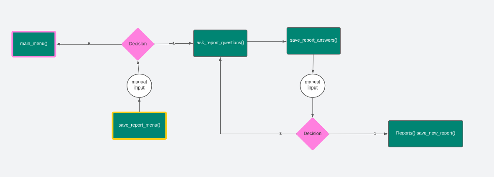

# ReVisPort
ReVisPort is a Python command line reporting tool which enable users to create simple reports. The reports provide the user with descriptive summary of climate data [climate data](https://github.com/owid/co2-data/blob/master/owid-co2-codebook.csv) of EU countries, presented by [Our World in Data](https://ourworldindata.org/co2-and-greenhouse-gas-emissions) . Besides that, ReVisPort offers the users to add the created reports to their personalized favourites list. Notes or findings can be added to simplify the task of finding interesting data insights. In addition, the user have a possibility to contact the developers of ReVisPort. 

 

TODO: screenshot or record

[View](https://re-vis-port-06a4efd9c1c6.herokuapp.com/) the app on-line.
---

## Table of Contents
- [UX](#ux)
- [Features](#features)
- [Testing](#testing)
- [Deployment](#deployment)
- [Technologies](#technologies)
- [Credits & Inspirations](#credits&inspirations)
- [Acknowledgements](#acknowledgemetns)

---
## UX
The goal of ReVisPort is to search for interesting insights of climate data. ReVisPort targets particully users interesting in climate data and data generally. Users do not have to any pre-knowledge about reporting, ReVisPort navigates users step by step. However, bacis knowledge about descriptive statistics are required in order to interprete results.

### User Stories
- As a User, I would like create a report without any programming nor statistic knowledge.
- As a User, I would like to be able to change choices I made.
- As a User, I would like to display a created report with all standard aspects.
- As a User, I would like to make notes to about the data instights
- As a User, I would like to have a possibility to save a report.
- As a User, I would like to see all my saved reports and come back to each of them.
- As a User, I would like to delete a saved report, which I do not need anymore.
- As a User, I would like to return to home menu without restarting the application.
- As a User, I would like to write reference or contact the application developer.

### Colors
Color text using ANSI Code was considered to make the command line application more user-friendly. In total 5 colors were selected. Each color was used only for one purpose, see Table below.

| Color  | ANSI Code | Purpose                                         | Examples                                |
|--------|-----------|-------------------------------------------------|-----------------------------------------|
| White  | [95m      | displayed information, no question, user inputs |                                         |
| Green  | [92m      | actions, successes or asking for user inputs    | Saving...; Enter your choice:           |
| Purple | [95m      | generated tables and report                     |                                         |
| Yellow | [33m      | warnings                                        | Invalid data                            |
| Cyan   | [96m      | questions or menus                              | Select a time period from 2000 and 2020 |

### Logical Flow

- Home Menu 

- Reporting Menu & Save Report Menu 

  
   

- Favourites Menu 

- Contact Menu 

---
## Features

### Differences to Design
### Future Enhancements

## Testing

## Deployment

### To Fork
TODO

### To Clone Repository
In order to clone the repository locally, follow the steps:

1. On Git
    - Go to the repository, i.e. https://github.com/brodsa/re-vis-port
    - You see the content of the repository, i.e. all the files are listed. On the right side at the top of the list, find the Code drop down button and click on it.
    - Copy the repository HTTPS link to the clipboard.
2. In the terminal (Note: git must be preinstalled) 
    - Open the terminal and navigate, where you want to clone the repository.
    - Type `git clone` and insert the content from the clipboard, leading to the command `git clone https://github.com/brodsa/re-vis-port.git`. 
    - Once the project is cloned, you can start using the repository locally.

### To Deploy on Heroku

In order to deploy the app on Heroku, an account is required. The steps for the deyploment are as follows:
1. Click "New" and "Create new App" from the menu at right top, see [screenshot](./docs/deployment/01_click_new.png).
2. Insert a app name and select a region. Click "Create App"; see [screenshot](./docs/deployment/02_create_app.png).
3. Select the "GitHub" deployment method; see [screenshot](./docs/deployment/03_deployment_method.png)
4. Search for a repository to connect and a branch to deploy; see [screenshot](./docs/deployment/04_select_repository_branch.png)
5. In the "Setting" tab, go in the section "Buildpacks" and add two buildpacks in the following order (see [here](./docs/deployment/06_buildpacks.png)): 
    - `heroku/python`
    - `heroku/nodejs`
6. In the "Config Var" section, add two variables (see [screenshot](./docs/deployment/07_config_vars.png)):
    - `PORT`: 8000
    - `CREDS`: credentials to connect with a google worksheet
7. In the "Domain" section, copy the URL to view the app; see [screenshot](./docs/deployment/08_copy_url.png).

## Technologies
### Languages
- Python
    - [art](https://pypi.org/project/art/)
    - [gspread](https://docs.gspread.org/en/v5.10.0/)
    - [google_auth](https://google-auth.readthedocs.io/en/master/)
    - [pandas](https://pandas.pydata.org/)
    - [tabulate](https://pypi.org/project/tabulate/)
    - [PyYAML](https://pypi.org/project/PyYAML/)
- Markdown

### Tools
- [Lucid](https://lucid.app/documents#/documents?folder_id=recent) to create a flow chart.
- [Generator of Markdown Tables](https://www.tablesgenerator.com/markdown_tables)
- [PEP Validators](https://pep8ci.herokuapp.com/#)

## Credits & Inspiration
- Data Sources
    - [Our Word in Data](https://github.com/owid/co2-data/blob/master/owid-co2-codebook.csv)
    - [List of the EU countries](https://european-union.europa.eu/principles-countries-history/country-profiles_en)
- Documentation of all listed python libraries, see (#languages)
- [Empty directory](https://stackoverflow.com/questions/185936/how-to-delete-the-contents-of-a-folder)
- [Color definition](https://www.geeksforgeeks.org/print-colors-python-terminal/)
- [ANSI color coding](https://codehs.com/tutorial/andy/ansi-colors)
- Background Image by [Mika Baumeister](https://unsplash.com/photos/Wpnoqo2plFA?utm_source=unsplash&utm_medium=referral&utm_content=creditShareLink) on [Unsplash](https://unsplash.com/photos/Wpnoqo2plFA?utm_source=unsplash&utm_medium=referral&utm_content=creditCopyText)
- [Repository Template from Code Institute](https://github.com/Code-Institute-Org/p3-template)

## Acknowledgements
I would like to thank my mentors, [Gareth McGirr](https://github.com/Gareth-McGirr) and [TODO](), for their guidance through my project and their valuable inputs. And my special thanks go to my husband for being supportive during the development of the program.

