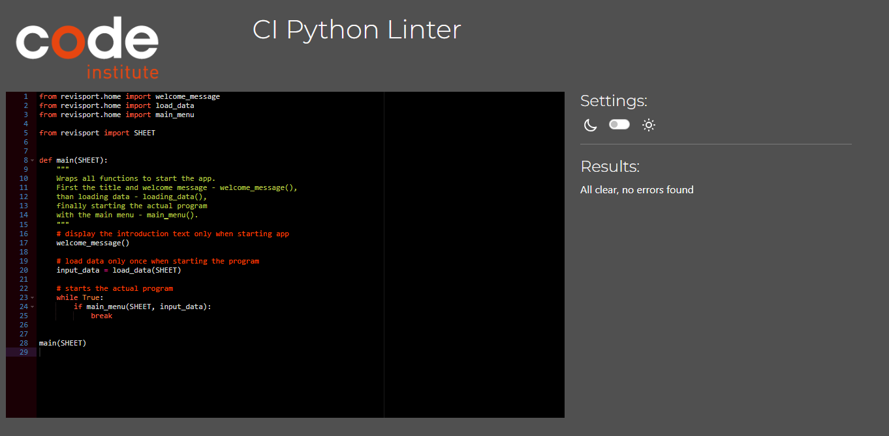

# Testing report

## Validation
To validate the python code, [CI Python Linter](https://pep8ci.herokuapp.com/#) was used. The validation did not revealed any errors.
| Python file               | Report | Results   |
|---------------------------|--------|-----------|
| `run.py`                  |  | no errors |
| `revisport/__init__.py`   |        | no errors |
| `revisport/colors.py`     |        | no errors |
| `revisport/contact.py`    |        | no errors |
| `revisport/favourites.py` |        | no errors |
| `revisport/helpers.py`    |        | no errors |
| `revisport/home.py`       |        | no errors |
| `revisport/quit.py`       |        | no errors |
| `revisport/reporting.py`  |        | no errors |

## Functional Testing
Below detailed test of functional testing, which was conducted manually.
- [Home Menu](#home-menu)
- [Reporting Menu](#reporting-menu)
- [Saving Report Menu](#saving-report-menu)
- [Favourites Menu](#favourites-menu)
- [Contact Menu](#contact-menu)

### Home Menu
| ID  | Description                              | Steps                                                                                                                                          | Expected                                                                                           | Actual                        | Result |
|-----|------------------------------------------|------------------------------------------------------------------------------------------------------------------------------------------------|----------------------------------------------------------------------------------------------------|-------------------------------|--------|
| T01 | Title, welcome message, and HOME  menu. | Run program and make sure that   ReVisPort, welcome message and the home menu (1: Reporting, 2 Favourites, 3   Contact, 0 Quit) are displayed. | Everything displayed properly                                                                      | Everything displayed properly | PASS   |
| T02 | Option 1 Reporting                       | Enter 1                                                                                                                                        | Reporting menu is displayed.                                                                       | Reporting menu is displayed.  | PASS   |
| T03 | Option 2 Favourites                      | Enter 2                                                                                                                                        | Favourites menu is displayed   with a table of saved reports.                                      | Favourites menu is displayed. | PASS   |
| T04 | Option 3 Contact                         | Enter 3                                                                                                                                        | Contact menu is displayed.                                                                         | Contact menu is displayed.    | PASS   |
| T05 | Option 0 Quit                            | Enter 0                                                                                                                                        | Quit menu is displayed:   Information about quitting the app and question to remove saved reports. | Quit menu is displayed.       | PASS   |
| T06 | Invalid input                            | Enter string; number other than   0-3; blank spaces or press enter                                                                             | Warning message is displayed.                                                                      | Aborts when pressing enter.   | BUG    |

### Reporting Menu
| ID  | Description                              | Steps                                                                                                                                          | Expected                                                                                           | Actual                        | Result |
|-----|------------------------------------------|------------------------------------------------------------------------------------------------------------------------------------------------|----------------------------------------------------------------------------------------------------|-------------------------------|--------|
| T07 | Text and submenu                                                     | Text and submenu (1 Yes,   continue creating a report; 0 No, return to HOME) is displayed.                                      | Everything displayed properly                                                                                                                                                                       | Everything displayed properly                                                                               | PASS |
| T08 | Reporting Menu with option 1 Yes                                     | Enter 1                                                                                                                         | First question to select EU   countries displayed. Table with iso codes is displayed.                                                                                                               | First question to select EU   countries displayed. Table with iso codes is displayed.                       | PASS |
| T09 | Reporting Menu with option 0 No                                      | Enter 0                                                                                                                         | Return to HOME.                                                                                                                                                                                     | Return to HOME.                                                                                             | PASS |
| T10 | Reporting menu with an invalid   input                               | Enter string; number other than   0-1; blank spaces or press enter                                                              | Warning message is displayed.                                                                                                                                                                       | Warning message is displayed.                                                                               | PASS |
| T11 | Selection of countries with a   valid input                          | Enter iso codes from table in   format iso1,iso2:      - SWE      - swe      - swe,cze      - swe, cze                          | No warning/errors, next question   to select time period is displayed                                                                                                                               | No warning/errors, next question   to select time period is displayed.                                      | PASS |
| T12 | Selection of countries with an   invalid input                       | Enter following:      - swe,      - invalid iso, i.e. sew      - swe.cze      - blank space or press enter                      | Warning message is   displayed:      - missing iso code      - invalid iso code      - invalid separator                                                                                            | Warning message is displayed.                                                                               | PASS |
| T13 | Selection of time period with a   valid input                        | Enter following:      - 2000-2002      - 2000 - 2020                                                                            | No warning/error, next question   to select index is displayed                                                                                                                                      | No warning/error, next question   to select index is displayed                                              | PASS |
| T14 | Selection of time period with an   invalid input                     | Enter following:      - 0 - 20      - 2000      - 2000- 20      - 2020 - 2002      - black space or press enter      - a string | Warning message is displayed:         - selection not in the range      - not a valid form or no number      - a lower bound is larger than an upper bound      - no number or invalid range format | Warning message is displayed.                                                                               | PASS |
| T15 | Selection of index with a valid   input                              | Enter numbers from 1-6                                                                                                          | No warning/error, a confirmation   question displayed                                                                                                                                               | No warning/error, a confirmation   question displayed                                                       | PASS |
| T16 | Selection of index with an   invalid input                           | Enter following:      - numbers other than 1-6      - string      - blank space or press enter                                  | Warning message is   displayed:      - only numbers 1-6 are allowed      - not a number      - not a number                                                                                         | Warning message is   displayed:      - only numbers 1-6 are allowed      - not a number      - not a number | PASS |
| T17 | Selection recap and confirmation                                     | Recap and confirmation question   (1: generate summary statistics, 2 make changes) are displayed.                               | Everything displayed properly.                                                                                                                                                                      | Everything displayed properly                                                                               | PASS |
| T18 | Confirmation with a valid input   to generate summary table          | Enter 1                                                                                                                         | Summary descriptive statistics   and raw data are displayed                                                                                                                                         | Error when missing data                                                                                     | BUG  |
| T19 | Confirmation with a valid input   to make changes                    | Enter 2                                                                                                                         | First question to select EU   countries is displayed.                                                                                                                                               | First question to select EU   countries is displayed.                                                       | PASS |
| T20 | Confirmation with an invalid   input                                 | Enter following:      - numbers other than 1-2      - string      - blank space or press enter                                  | Warning message is   displayed:      - only numbers 1-2 are allowed      - not a number      - not a number                                                                                         | Warning message is displayed                                                                                | PASS |
| T21 | Ask to save summary table with a   valid choice to finish the report | Enter 1                                                                                                                         | User is informed about saving   tables and a next question to enter a report title is displayed.                                                                                                    | User is informed about saving   tables and a next question to enter a report title is displayed.            | PASS |
| T22 | Ask to save summary table with a   valid choice to return HOME       | Enter 0                                                                                                                         | Return HOME                                                                                                                                                                                         | Return HOME                                                                                                 | PASS |
| T23 | Ask to save summary table with   an invalid input                    | Enter following:      - numbers other than 0-1      - string      - blank space or press enter                                  | Warning message is   displayed:      - only numbers 0-1 are allowed      - not a number      - not a number                                                                                         | Warning message is displayed                                                                                | PASS |

### Saving Report Menu
| ID  | Description                              | Steps                                                                                                                                          | Expected                                                                                           | Actual                        | Result |
|-----|------------------------------------------|------------------------------------------------------------------------------------------------------------------------------------------------|----------------------------------------------------------------------------------------------------|-------------------------------|--------|
| T07 | Text and submenu                                                     | Text and submenu (1 Yes,   continue creating a report; 0 No, return to HOME) is displayed.                                      | Everything displayed properly                                                                                                                                                                       | Everything displayed properly                                                                               | PASS |
| T08 | Reporting Menu with option 1 Yes                                     | Enter 1                                                                                                                         | First question to select EU   countries displayed. Table with iso codes is displayed.                                                                                                               | First question to select EU   countries displayed. Table with iso codes is displayed.                       | PASS |
| T09 | Reporting Menu with option 0 No                                      | Enter 0                                                                                                                         | Return to HOME.                                                                                                                                                                                     | Return to HOME.                                                                                             | PASS |
| T10 | Reporting menu with an invalid   input                               | Enter string; number other than   0-1; blank spaces or press enter                                                              | Warning message is displayed.                                                                                                                                                                       | Warning message is displayed.                                                                               | PASS |
| T11 | Selection of countries with a   valid input                          | Enter iso codes from table in   format iso1,iso2:      - SWE      - swe      - swe,cze      - swe, cze                          | No warning/errors, next question   to select time period is displayed                                                                                                                               | No warning/errors, next question   to select time period is displayed.                                      | PASS |
| T12 | Selection of countries with an   invalid input                       | Enter following:      - swe,      - invalid iso, i.e. sew      - swe.cze      - blank space or press enter                      | Warning message is   displayed:      - missing iso code      - invalid iso code      - invalid separator                                                                                            | Warning message is displayed.                                                                               | PASS |
| T13 | Selection of time period with a   valid input                        | Enter following:      - 2000-2002      - 2000 - 2020                                                                            | No warning/error, next question   to select index is displayed                                                                                                                                      | No warning/error, next question   to select index is displayed                                              | PASS |
| T14 | Selection of time period with an   invalid input                     | Enter following:      - 0 - 20      - 2000      - 2000- 20      - 2020 - 2002      - black space or press enter      - a string | Warning message is displayed:         - selection not in the range      - not a valid form or no number      - a lower bound is larger than an upper bound      - no number or invalid range format | Warning message is displayed.                                                                               | PASS |
| T15 | Selection of index with a valid   input                              | Enter numbers from 1-6                                                                                                          | No warning/error, a confirmation   question displayed                                                                                                                                               | No warning/error, a confirmation   question displayed                                                       | PASS |
| T16 | Selection of index with an   invalid input                           | Enter following:      - numbers other than 1-6      - string      - blank space or press enter                                  | Warning message is   displayed:      - only numbers 1-6 are allowed      - not a number      - not a number                                                                                         | Warning message is   displayed:      - only numbers 1-6 are allowed      - not a number      - not a number | PASS |
| T17 | Selection recap and confirmation                                     | Recap and confirmation question   (1: generate summary statistics, 2 make changes) are displayed.                               | Everything displayed properly.                                                                                                                                                                      | Everything displayed properly                                                                               | PASS |
| T18 | Confirmation with a valid input   to generate summary table          | Enter 1                                                                                                                         | Summary descriptive statistics   and raw data are displayed                                                                                                                                         | Error when missing data                                                                                     | BUG  |
| T19 | Confirmation with a valid input   to make changes                    | Enter 2                                                                                                                         | First question to select EU   countries is displayed.                                                                                                                                               | First question to select EU   countries is displayed.                                                       | PASS |
| T20 | Confirmation with an invalid   input                                 | Enter following:      - numbers other than 1-2      - string      - blank space or press enter                                  | Warning message is   displayed:      - only numbers 1-2 are allowed      - not a number      - not a number                                                                                         | Warning message is displayed                                                                                | PASS |
| T21 | Ask to save summary table with a   valid choice to finish the report | Enter 1                                                                                                                         | User is informed about saving   tables and a next question to enter a report title is displayed.                                                                                                    | User is informed about saving   tables and a next question to enter a report title is displayed.            | PASS |
| T22 | Ask to save summary table with a   valid choice to return HOME       | Enter 0                                                                                                                         | Return HOME                                                                                                                                                                                         | Return HOME                                                                                                 | PASS |
| T23 | Ask to save summary table with   an invalid input                    | Enter following:      - numbers other than 0-1      - string      - blank space or press enter                                  | Warning message is   displayed:      - only numbers 0-1 are allowed      - not a number      - not a number                                                                                         | Warning message is displayed                                                                                | PASS |

### Favourites Menu
| ID  | Description                              | Steps                                                                                                                                          | Expected                                                                                           | Actual                        | Result |
|-----|------------------------------------------|------------------------------------------------------------------------------------------------------------------------------------------------|----------------------------------------------------------------------------------------------------|-------------------------------|--------|
| T31 | View a saved report                     | Enter 1                                                                                         | Question to enter ID of a report   to view.                                                                 | Question to enter ID of a report   to view.                                                          | PASS  |
| T32 | Delete a saved report                   | Enter 2                                                                                         | Question to enter ID of a report   to delete.                                                               | Question to enter ID of a report   to delete.                                                        | PASS  |
| T33 | Create a report                         | Enter 3                                                                                         | Reporting menu is displayed.                                                                                | Reporting menu is displayed.                                                                         | PASS  |
| T34 | Return HOME                             | Enter 0                                                                                         | HOME Menu is displayed.                                                                                     | HOME Menu is displayed.                                                                              | PASS  |
| T35 | Favourites Menu with an invalid   input | Enter following:      - numbers other than 0-3      - string      - blank space or press enter  | Warning message is   displayed:      - only numbers 0-3 are allowed      - not a number      - not a number | Warning message is displayed                                                                         | PASS  |
| T36 | Select ID and view report               | Enter a valid ID from the table.                                                                | A report with all sections is   displayed. Message to press any key to continue is displayed.               | A report with all sections is   displayed. Message to press any key to continue is displayed.        | PASS  |
| T37 | Select ID and delete report             | Enter a valid ID from the table.                                                                | Message about removing the   report is displayed and updated overview of saved reports is displayed.        | Message about removing the   report is displayed and updated overview of saved reports is displayed. | PASS  |
| T38 | Select ID with invalid data             | Enter following:      - not displayed ID number      - string      - blank space or press Enter | Warning message:      - invalid choice of ID      - not a number      - not a number                        | A bit confusing displayed   message                                                                  | ISSUE |

### Contact Menu
| ID  | Description                              | Steps                                                                                                                                          | Expected                                                                                           | Actual                        | Result |
|-----|------------------------------------------|------------------------------------------------------------------------------------------------------------------------------------------------|----------------------------------------------------------------------------------------------------|-------------------------------|--------|
| T39 | Contact Menu with a valid input   to send a message                         | Enter 1                                                                                        | Ask to fill in the contact form   with the first question to enter a first name.                            | Everything displayed properly                                                                   | PASS |
| T40 | Contact Menu with a valid input   to return HOME                            | Enter 0                                                                                        | Return HOME.                                                                                                | Return HOME                                                                                     | PASS |
| T41 | Contact Menu with an invalid   input                                        | Enter following:      - numbers other than 0-1      - string      - blank space or press enter | Warning message is   displayed:      - only numbers 0-1 are allowed      - not a number      - not a number | Warning message is displayed                                                                    | PASS |
| T42 | Enter first name                                                            | Every input is allowed.                                                                        | No warnings or errors. Next   question to enter last name is displayed                                      | No warnings or errors. Next   question to enter last name is displayed                          | PASS |
| T43 | Enter last name                                                             | Every input is allowed.                                                                        | No warnings or errors. Next   question to enter email is displayed.                                         | No warnings or errors. Next   question to enter email is displayed.                             | PASS |
| T44 | Enter email with a valid input                                              | Enter a valid email.                                                                           | Next question to enter a message   is displayed.                                                            | Next question to enter a message   is displayed                                                 | PASS |
| T45 | Enter email with an invalid   input                                         | Enter the following:      - test      -test@      - test@test                                  | Warning message is   displayed.      - missing @      - missing domain      - missing domain                | Warning message displayed                                                                       | PASS |
| T46 | Enter message with a valid input                                            | Write a message with some text                                                                 | No warnings or errors. Question   to send the message displayed.                                            | No warnings or errors. Question   to send the message displayed.                                | PASS |
| T47 | Enter message with an invalid   input                                       | Press enter or insert blank spaces                                                             | Warning message "empty   message" displayed                                                                 | Warning message displayed.                                                                      | PASS |
| T48 | Ask to send the contact message   with a valid input of sending the message | Enter 1                                                                                        | Information about sending is   displayed. Message to press any key to return HOME is displayed.             | Information about sending is   displayed. Message to press any key to return HOME is displayed. | PASS |
| T49 | Ask to send the contact message   with a valid input of making changes      | Enter 2                                                                                        | Question to enter the first name   is displayed.                                                            | Question to enter the first name   is displayed.                                                | PASS |
| T50 | Ask to send the contact message   with an invalid input                     | Enter following:      - numbers other than 1-2      - string      - blank space or press enter | Warning message is   displayed:      - only numbers 1-2 are allowed      - not a number      - not a number | Warning message is displayed                                                                    | PASS |

### Quit Menu
| ID  | Description                              | Steps                                                                                                                                          | Expected                                                                                           | Actual                        | Result |
|-----|------------------------------------------|------------------------------------------------------------------------------------------------------------------------------------------------|----------------------------------------------------------------------------------------------------|-------------------------------|--------|
| T39 | Contact Menu with a valid input   to send a message                         | Enter 1                                                                                        | Ask to fill in the contact form   with the first question to enter a first name.                            | Everything displayed properly                                                                   | PASS |
| T40 | Contact Menu with a valid input   to return HOME                            | Enter 0                                                                                        | Return HOME.                                                                                                | Return HOME                                                                                     | PASS |
| T41 | Contact Menu with an invalid   input                                        | Enter following:      - numbers other than 0-1      - string      - blank space or press enter | Warning message is   displayed:      - only numbers 0-1 are allowed      - not a number      - not a number | Warning message is displayed                                                                    | PASS |
| T42 | Enter first name                                                            | Every input is allowed.                                                                        | No warnings or errors. Next   question to enter last name is displayed                                      | No warnings or errors. Next   question to enter last name is displayed                          | PASS |
| T43 | Enter last name                                                             | Every input is allowed.                                                                        | No warnings or errors. Next   question to enter email is displayed.                                         | No warnings or errors. Next   question to enter email is displayed.                             | PASS |
| T44 | Enter email with a valid input                                              | Enter a valid email.                                                                           | Next question to enter a message   is displayed.                                                            | Next question to enter a message   is displayed                                                 | PASS |
| T45 | Enter email with an invalid   input                                         | Enter the following:      - test      -test@      - test@test                                  | Warning message is   displayed.      - missing @      - missing domain      - missing domain                | Warning message displayed                                                                       | PASS |
| T46 | Enter message with a valid input                                            | Write a message with some text                                                                 | No warnings or errors. Question   to send the message displayed.                                            | No warnings or errors. Question   to send the message displayed.                                | PASS |
| T47 | Enter message with an invalid   input                                       | Press enter or insert blank spaces                                                             | Warning message "empty   message" displayed                                                                 | Warning message displayed.                                                                      | PASS |
| T48 | Ask to send the contact message   with a valid input of sending the message | Enter 1                                                                                        | Information about sending is   displayed. Message to press any key to return HOME is displayed.             | Information about sending is   displayed. Message to press any key to return HOME is displayed. | PASS |
| T49 | Ask to send the contact message   with a valid input of making changes      | Enter 2                                                                                        | Question to enter the first name   is displayed.                                                            | Question to enter the first name   is displayed.                                                | PASS |
| T50 | Ask to send the contact message   with an invalid input                     | Enter following:      - numbers other than 1-2      - string      - blank space or press enter | Warning message is   displayed:      - only numbers 1-2 are allowed      - not a number      - not a number | Warning message is displayed                                                                    | PASS |